# MS‑Portfolio — Marcelo Santos

[](https://github.com/marcelo-m7/MS-Portfolio/actions/workflows/ci.yml)
[](https://marcelo.monynha.com)
[](https://supabase.com)
[](https://www.typescriptlang.org/)
[](https://vitejs.dev/)

Portfolio pessoal e site profissional de [@marcelo-m7](https://github.com/marcelo-m7), fundador da Monynha Softwares. Este repositório é um laboratório vivo para interações modernas, acessibilidade, 3D e boas práticas de front-end.



> Experiência imersiva com animações 3D em WebGL, design responsivo e suporte multilíngue (PT, EN, ES, FR)

## Table of Contents

- [Overview](#overview)
- [Setup](#setup)
- [Development](#development)
- [Testing](#testing)
- [Build](#build)
- [Deployment](#deployment)
- [Language handling](#language-handling)
- [Contributing](#contributing)
- [License / Contact](#license--contact)

## Overview

SPA built with Vite + React + TypeScript, styled with Tailwind and shadcn/ui, data-driven via a `cv.json` source with optional Supabase backend. CI runs lint, tests, and build on every push/PR.

Quick docs: browse the full docs index at [docs/README.md](./docs/README.md).

## Setup

Prerequisites:

- Node.js >= 20.19
- npm >= 9

Instale dependências:

```powershell
npm install
```

Ambiente (opcional, Supabase): crie `.env` (veja "Banco de dados")

Dev server (porta 8080):

```powershell
npm run dev
```

Build de produção:

```powershell
npm run build
```

Preview do build:

```powershell
npm run preview
```

Testes e lint:

```powershell
npm run test
npm run lint
```

---

## 🧰 Scripts úteis

- `npm run dev` — servidor de desenvolvimento
- `npm run build` — build de produção
- `npm run preview` — serve o build localmente
- `npm run test` — Vitest (use `--coverage` para cobertura)
- `npm run lint` — ESLint + typecheck

---

## Testing

This project uses Vitest for unit tests and also includes a few manual helper scripts.

### Unit tests

- Run all tests:

```powershell
npm run test
```

- With coverage (used in CI):

```powershell
npm run test:coverage
```

### Manual test scripts

These scripts live under `tests/` to keep the repo root clean.

- Connectivity and Supabase sanity checks:
  - Script: `tests/test-connectivity.js`
  - What it does: verifies Supabase connection, reads basic data from the `portfolio` schema, attempts a test insert into `public.leads` (RLS-aware), and runs a JOIN sample.
  - Run (PowerShell):

```powershell
node .\tests\test-connectivity.js
```

Tip: you can override credentials with env vars `VITE_SUPABASE_URL` and `VITE_SUPABASE_KEY`.

- Free Google Translate endpoint demo:
  - Script: `tests/test-free-translation.js`
  - What it does: makes a few translation requests to the free web endpoint and prints results.
  - Run (PowerShell, Node 20+):

```powershell
node .\tests\test-free-translation.js
```

Or paste into your browser DevTools console to run in-page.

- Supabase Edge Function email test:
  - Script: `tests/test-edge-function.sh`
  - What it does: posts a payload to the `send-contact-email` Edge Function.
  - Run (bash):

```bash
chmod +x tests/test-edge-function.sh
./tests/test-edge-function.sh
```

Windows: run via WSL or Git Bash. Update the URL/key inside the script as needed.

---

## 🏗️ Arquitetura em 1 minuto

- Frontend: React 18 + TypeScript + Vite 7
- Estilos: Tailwind + shadcn/ui
- Estado/Async: TanStack Query
- 3D: Three.js / React Three Fiber
- Animações: Framer Motion
- Router: React Router v6
- Testes: Vitest (+ happy-dom)
- CI/CD: GitHub Actions

Estrutura:

```text
MS-Portfolio/
├── src/
│   ├── components/     # UI (shadcn + custom)
│   ├── pages/          # Rotas (lazy-loaded)
│   ├── lib/            # Utils, client Supabase, traduções
│   ├── hooks/          # Hooks React
│   └── types/          # Tipos TS
├── public/
│   ├── data/           # cv.json (fonte de conteúdo)
│   └── images/         # SVGs acessíveis (com <title>)
└── supabase/
    └── migrations/     # Schema & seeds
```

---

## 🌍 Conteúdo & Idiomas

- **Projetos, séries, artes**: `public/data/cv.json`
- **Blog posts (Pensamentos)**: Markdown files in `public/content/blog/` (see [Adding Blog Posts](#-adding-blog-posts) below)
- Idiomas e eventos: `src/lib/language.ts` (evento `monynha:languagechange`)
- Traduções dinâmicas: `src/lib/translateService.ts` (endpoint web do Google Translate com cache em `localStorage`)

### Adding Content (Projects, Art, Series)

1. Edite `public/data/cv.json`  
1. Adicione uma miniatura SVG em `public/images/` com `<title>`  
1. Referencie no JSON (ex.: `"thumbnail": "/images/meu-projeto.svg"`)  
1. Rode `npm run build` para verificar orçamento de bundle

### 📝 Adding Blog Posts

Blog posts are written in Markdown with YAML frontmatter. To add a new post:

1. Create a new `.md` file in `public/content/blog/`:

```markdown
---
title: "Your Post Title"
date: "2025-11-02"
author: "Marcelo Santos"
tags: ["tag1", "tag2", "tag3"]
excerpt: "A short summary of your post (1-2 sentences)."
---

Your markdown content goes here...
```

1. Add the slug (filename without `.md`) to the `BLOG_POSTS` array in `src/lib/markdownLoader.ts`:

```typescript
const BLOG_POSTS = [
  'design-tecnologia-inclusiva',
  'your-new-post-slug',  // Add here
];
```

1. Build and verify: `npm run build`

**Note**: Blog posts support full Markdown syntax including code blocks, lists, links, and emphasis.

---

## 🗄️ Banco de dados (opcional)

Integra com **Supabase** e faz graceful fallback para `cv.json` quando indisponível.

1. Crie `.env` com:

```bash
VITE_SUPABASE_URL=https://seu-projeto.supabase.co
VITE_SUPABASE_KEY=sua-anon-key
VITE_SUPABASE_SCHEMA=portfolio
```

1. (Optional) Configure email fallback for contact form:
   - Deploy the `send-contact-email` Edge Function (see `EDGE_FUNCTION_SETUP.md`)
   - Add `RESEND_API_KEY` secret in Supabase Dashboard
1. Restart the dev server

**📖 For complete database setup, schema details, and migration guide, see [SUPABASE.md](./docs/SUPABASE.md)**  
**📧 For Edge Function deployment and email configuration, see [EDGE_FUNCTION_SETUP.md](./docs/EDGE_FUNCTION_SETUP.md)**

### Database Schema (15 Tables)

- `profile` - Portfolio owner profile (singleton)
- `contact` - Contact form configuration (singleton)
- `projects` + `project_stack` + `technologies` - Project portfolio with tech stack
- `artworks` + `artwork_media` + `artwork_materials` - Art portfolio with media files
- `series` + `series_works` - Collections of related projects/artworks
- `thoughts` + `thought_tags` - Blog posts/articles with tags *(legacy: now using Markdown files)*
- `experience` + `experience_highlights` - Work history with achievements
- `skills` - Technical skills with proficiency levels

All contact form submissions automatically include `project_source='portfolio'` to identify their origin.

**Note**: The blog (Thoughts) now sources content from Markdown files in `public/content/blog/` instead of the database. The database tables are maintained for backwards compatibility but are not actively used for new blog posts.

## Language handling

The portfolio content is authored in Portuguese. The helper located at `src/lib/language.ts` keeps the `<html lang>` attribute in sync with the visitor preference stored in `localStorage` (`monynha-lang`) and broadcasts updates through the `monynha:languagechange` custom event. The `useCurrentLanguage` hook consumes that event so pages can reactively adjust locale-sensitive elements such as date formatting.

When introducing new locales, extend the `SUPPORTED_LANGUAGES` tuple inside `src/lib/language.ts` and provide translated copy for the pages and JSON datasets under `public/data/`.

To change the language programmatically you can call:

```ts
import { setLanguage } from '@/lib/language';

setLanguage('pt');
```

## Adding new projects to `cv.json`

Project cards, portfolio thumbnails and extra pages consume the single source of truth located at `public/data/cv.json`.

1. Duplicate an existing entry inside the `projects` array and adjust the fields (`name`, `summary`, `stack`, `url`, `category`, `year`).
2. Create a **vector** thumbnail (SVG only) under `public/images/`. Make sure to include a descriptive `<title>` element for accessibility and keep the canvas 16:9 (640x360 works well).
3. Reference the SVG through the `thumbnail` property (e.g. `"thumbnail": "/images/novo-projeto.svg"`).
4. Run `npm run build` to ensure the bundle stays under budget.

**Artworks and series** follow the same approach: update the JSON and link SVG assets—no raster formats should be added to the repository.

**Blog posts** are now managed via Markdown files (see [Adding Blog Posts](#-adding-blog-posts) section above).

## 📚 Documentation

- Full project documentation lives in [`./docs/`](./docs/)
- AI agent quickstart: [`AGENTS.md`](./AGENTS.md)
- Detailed rules for AI agents: [`AI_RULES.md`](./AI_RULES.md)

## Contributing

Issues and PRs are welcome. Please see [CONTRIBUTING.md](./docs/CONTRIBUTING.md) for guidelines, commit conventions, and local setup.

## License / Contact

MIT. © Marcelo Santos — [marcelo.monynha.com](https://marcelo.monynha.com)

For opportunities or questions, reach me at: <mailto:marcelo@monynha.com>

