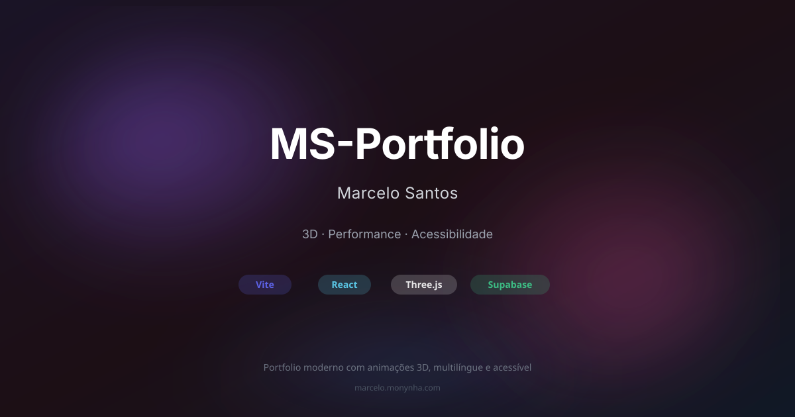

# MS‑Portfolio — Marcelo Santos

[](https://github.com/marcelo-m7/MS-Portfolio/actions/workflows/ci.yml)
[](https://marcelo.monynha.com)
[](https://supabase.com)
[](https://www.typescriptlang.org/)
[](https://vitejs.dev/)

Este é o meu portfólio pessoal e site profissional. Aqui eu apresento minha trajetória, projetos e experimentos como desenvolvedor e fundador da **Monynha Softwares**. Este repositório também funciona como um laboratório vivo onde exploro interações modernas, acessibilidade, experiências 3D e boas práticas de front‑end.



> Uma experiência imersiva com animações 3D em WebGL, design responsivo e suporte multilíngue (PT, EN, ES, FR).

## Table of Contents

* [Overview](#overview)
* [Setup](#setup)
* [Development](#development)
* [Testing](#testing)
* [Build](#build)
* [Deployment](#deployment)
* [Language handling](#language-handling)
* [Contributing](#contributing)
* [License / Contact](#license--contact)

## Overview

Este projeto é uma SPA construída com **Vite + React + TypeScript**, estilizada com **Tailwind** e **shadcn/ui**. O conteúdo é orientado por dados a partir de um arquivo `cv.json`, com backend opcional em **Supabase**. O pipeline de CI executa lint, testes e build a cada push ou pull request.

A documentação detalhada está disponível em [docs/README.md](./docs/README.md).

## Setup

### Pré‑requisitos

* Node.js >= 20.19
* npm >= 9

### Instalação

```powershell
npm install
```

### Ambiente (opcional — Supabase)

Crie um arquivo `.env` conforme descrito na seção de banco de dados.

### Servidor de desenvolvimento (porta 8080)

```powershell
npm run dev
```

### Build de produção

```powershell
npm run build
```

### Preview do build

```powershell
npm run preview
```

### Testes e lint

```powershell
npm run test
npm run lint
```

---

## 🧰 Scripts úteis

* `npm run dev` — servidor de desenvolvimento
* `npm run build` — build de produção
* `npm run preview` — serve o build localmente
* `npm run test` — testes com Vitest (use `--coverage` para cobertura)
* `npm run lint` — ESLint + verificação de tipos

---

## Testing

Utilizo **Vitest** para testes unitários, além de alguns scripts auxiliares para validações manuais.

### Testes unitários

* Executar todos os testes:

```powershell
npm run test
```

* Com cobertura (usado no CI):

```powershell
npm run test:coverage
```

### Scripts de teste manual

Os scripts ficam na pasta `tests/` para manter o repositório organizado.

* **Testes de conectividade e Supabase**

  * Script: `tests/test-connectivity.js`
  * O que faz: valida a conexão com o Supabase, lê dados básicos do schema `portfolio`, executa um insert de teste em `public.leads` (respeitando RLS) e roda um exemplo de JOIN.
  * Execução:

```powershell
node .\tests\test-connectivity.js
```

Variáveis `VITE_SUPABASE_URL` e `VITE_SUPABASE_KEY` podem ser sobrescritas via ambiente.

* **Demo de tradução via endpoint público do Google Translate**

  * Script: `tests/test-free-translation.js`
  * Execução:

```powershell
node .\tests\test-free-translation.js
```

Também pode ser executado diretamente no console do navegador.

* **Teste de Edge Function de e‑mail (Supabase)**

  * Script: `tests/test-edge-function.sh`
  * Execução:

```bash
chmod +x tests/test-edge-function.sh
./tests/test-edge-function.sh
```

No Windows, utilize WSL ou Git Bash.

---

## 🏗️ Arquitetura em 1 minuto

* Frontend: React 18 + TypeScript + Vite 7
* Estilos: Tailwind + shadcn/ui
* Estado e async: TanStack Query
* 3D: Three.js / React Three Fiber
* Animações: Framer Motion
* Roteamento: React Router v6
* Testes: Vitest (+ happy-dom)
* CI/CD: GitHub Actions

### Estrutura do projeto

```text
MS-Portfolio/
├── src/
│   ├── components/     # UI (shadcn + custom)
│   ├── pages/          # Rotas (lazy-loaded)
│   ├── lib/            # Utilitários, cliente Supabase, idiomas
│   ├── hooks/          # Hooks React
│   └── types/          # Tipos TypeScript
├── public/
│   ├── data/           # cv.json (fonte de conteúdo)
│   └── images/         # SVGs acessíveis (com <title>)
└── supabase/
    └── migrations/     # Schema e seeds
```

---

## 🌍 Conteúdo & Idiomas

* **Projetos, séries e artes**: `public/data/cv.json`
* **Posts (Pensamentos)**: arquivos Markdown em `public/content/blog/`
* Controle de idioma: `src/lib/language.ts`
* Traduções dinâmicas: `src/lib/translateService.ts` (com cache em `localStorage`)

### Adicionando conteúdo (projetos, artes, séries)

1. Edite `public/data/cv.json`
2. Adicione uma miniatura SVG em `public/images/` (com `<title>`)
3. Referencie no JSON (`"thumbnail": "/images/meu-projeto.svg"`)
4. Execute `npm run build` para validar o bundle

### 📝 Blog posts

Os posts são escritos em Markdown com frontmatter YAML:

```markdown
---
title: "Título do Post"
date: "2025-11-02"
author: "Marcelo Santos"
tags: ["tag1", "tag2"]
excerpt: "Resumo curto do post."
---

Conteúdo em Markdown...
```

Depois, adicione o slug ao array `BLOG_POSTS` em `src/lib/markdownLoader.ts` e gere o build.

---

## 🗄️ Banco de dados (opcional)

O projeto integra com **Supabase**, com fallback automático para `cv.json` caso o backend não esteja disponível.

Crie o arquivo `.env`:

```bash
VITE_SUPABASE_URL=https://seu-projeto.supabase.co
VITE_SUPABASE_KEY=sua-anon-key
VITE_SUPABASE_SCHEMA=portfolio
```

A configuração completa de schema e migrações está documentada em [`docs/SUPABASE.md`](./docs/SUPABASE.md).

### Schema

O banco possui tabelas para perfil, projetos, artes, séries, experiências profissionais, habilidades e contatos. O formulário de contato sempre registra `project_source='portfolio'` para rastreabilidade.

---

## Language handling

O conteúdo é originalmente escrito em português. O helper em `src/lib/language.ts` mantém o atributo `<html lang>` sincronizado com a preferência do visitante armazenada em `localStorage` (`monynha-lang`) e dispara um evento customizado para atualização reativa da interface.

Para adicionar novos idiomas, basta estender a lista de idiomas suportados e fornecer os textos traduzidos.

---

## Contributing

Issues e pull requests são bem‑vindos. Consulte [`CONTRIBUTING.md`](./docs/CONTRIBUTING.md) para convenções de commit e instruções de setup local.

## License / Contact

MIT. © Marcelo Santos — [https://marcelo.monynha.com](https://marcelo.monynha.com)

Para oportunidades ou dúvidas, entre em contato: [mailto:marcelo@monynha.com](mailto:marcelo@monynha.com)
